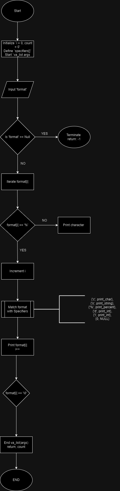

_printf: A Custom Implementation of printf

The _printf project is a custom implementation of the C standard library function printf. Designed to replicate some of the core features of printf, _printf formats and outputs data to the standard output based on specified format specifiers.

Features
Handles multiple format specifiers:
%c - Prints a single character.
%s - Prints a string.
%% - Prints a percent sign.
%d - Prints signed decimal integers.
Provides functionality for basic output formatting without support for advanced flags, width, or precision.

Requirements
-Ubuntu 22.04 LTS
-Compiler: GCC 9.3.0 or newer
-Version Control: Git 2.25.1 or newer
-Memory Debugger: Valgrind (optional, for memory testing)

The GCC compiler
gcc -Wall -Werror -Wextra -pedantic -std=gnu89 -Wno-format *.c

Examples of the code at work
|Code Snippet	                                         |Description	                            |Output                       |
---------------------------------------------------------|------------------------------------------|-----------------------------|
|_printf("Hello, World!\\n");                            |Prints a simple string.                   |Hello, World!                |
|_printf("Character: %c, String: %s\\n", 'A', "example");|Prints a character and a string.          |Character: A, String: example|
|_printf("Number: %d\\n", 123);                          |Prints an integer.                        |Number: 123                  |
|_printf("Signed Integer: %i\\n", -456);                 |Prints a signed integer.                  |Signed Integer: -456         |
|_printf("Percent sign: 100%% accuracy!\\n");            |Prints a percent sign.                    |Percent sign: 100% accuracy! |
|_printf("Multiple: %c %s %d%%\\n", 'X', "data", 50);    |Combines multiple specifiers.             |Multiple: X data 50%         |
|_printf(NULL);	Handles a NULL format string.            |-1                                        | (Error, returns -1)         |
|_printf("Incomplete: %");                               |Handles incomplete specifiers.            |%                            |

## _printf Manual Page

## Documentation

- [Man Page for _printf](./man_3_printf.3)
